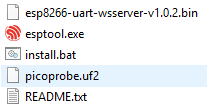

FAQ
=========

Arduino
---------------------

#. Code upload failed in Arduino IDE?
    * Check that your Pico is correctly recognised by the Arduino IDE, the port should be COMXX (Raspberry Pi Pico), for instructions please refer to :ref:`setup_pico_arduino`.
    * Check that the Board(Raspberry Pi Pico) or port（COMXX (Raspberry Pi Pico)）is selected correctly.
    * If your code is OK and you have selected the correct board and port, but the upload is still not successful. At this point you can click on the **Upload** icon again, when the progress below shows "Upload...", unplug the USB cable, then press and hold the **BOOTSEL** button to plug it in and the code will be uploaded successfully.

MicroPython
------------------

#. How to open and run the code?
    For detailed tutorials, please refer to :ref:`open_run_code_py`.

#. How to upload library to Raspberry Pi Pico？
    For detailed tutorials, please refer to :ref:`add_libraries_py`.

#. NO MicroPython(Raspberry Pi Pico) Interpreter Option on Thonny IDE?
    * Check that your Pico is plugged into your computer via a USB cable.
    * Check that you have installed MicroPython for Pico (:ref:`install_micropython_on_pico`).
    * The Raspberry Pi Pico interpreter is only available in version 3.3.3 or higher version of Thonny. If you are running an older version, please update (:ref:`thonny_ide`).
    * Plug in/out the micro USB cable sveral times.

#. Cannot open Pico code or save code to Pico via Thonny IDE?
    * Check that your Pico is plugged into your computer via a USB cable.
    * Check that you have selected the Interpreter as **MicroPython (Raspberry Pi Pico)**.

#. Can Raspberry Pi Pico be used on Thonny and Arduino at the same time?
    NO, you need to do some different operations.

    * If you used it on Arduino first, and now you want to use it on Thonny IDE, you need to :ref:`install_micropython_on_pico` on it.
    * If you used it on Thonny first， and now you want to use it on Arduino IDE, you need to :ref:`setup_pico_arduino`.

#. If your computer is win7 and pico cannot be detected.
    * Download the USB CDC driver from http://aem-origin.microchip.com/en-us/mindi-sw-library?swsearch=Atmel%2520USB%2520CDC%2520Virtual%2520COM%2520Driver
    * Unzip the ``amtel_devices_cdc.inf`` file to a folder named ``pico-serial``.
    * Change the name of ``amtel_devices_cdc.inf`` file to ``pico-serial.inf``.
    * Open/edit the ``pico-serial.inf`` in a basic editor like notepad
    * Remove and replace the lines under the following headings:

    .. code-block::

        [DeviceList]
        %PI_CDC_PICO%=DriverInstall, USB\VID_2E8A&PID_0005&MI_00

        [DeviceList.NTAMD64]
        %PI_CDC_PICO%=DriverInstall, USB\VID_2E8A&PID_0005&MI_00

        [DeviceList.NTIA64]
        %PI_CDC_PICO%=DriverInstall, USB\VID_2E8A&PID_0005&MI_00

        [DeviceList.NT]
        %PI_CDC_PICO%=DriverInstall, USB\VID_2E8A&PID_0005&MI_00

        [Strings]
        Manufacturer = "ATMEL, Inc."
        PI_CDC_PICO = "Pi Pico Serial Port"
        Serial.SvcDesc = "Pi Pico Serial Driver"

    #. Close and save and make sure your retain the name as pico-serial.inf
    #. Go to your pc device list, find the pico under Ports, named something like CDC Device. A yellow exclamation mark indicates it.
    #. Right click on the CDC Device and update or install driver choosing the file you created from the location you saved it at.

Piper Make
------------------

#. How to set up the Pico on Piper Make?
    For detailed tutorials, please refer to :ref:`per_setup_pico`.

#. How to download or import code?
    For detailed tutorials, please refer to :ref:`per_save_import`.

#. How to connect to Pico?
    For detailed tutorials, please refer to :ref:`connect_pico_per`.

.. _burn_firmware:

How to re-burn the firmware for ESP8266 module?
-----------------------------------------------------

**1. Download firmwre and burn-in tool**

* :download:`ESP8266 Firmware <https://github.com/sunfounder/euler-kit/raw/main/esp8266/esp8266%20firmware.zip>`

After unzipping, you will see 3 files.

* ``esp8266-uart-wsserver-v1.0.2.bin``: The firmware to burn to the ESP8266 module.
* ``esptool.exe``: This is a command-line utility for Windows.
* ``install.bat``: This is the command package for Windows system, double click this file will run all the commands inside the file.
* ``picoprobe.uf2``: This file allows a Pico to act as a USB → SWD and UART converter.

**2. Set Pico as a USB → SWD and UART converter**

#. Hold down the **BOOTSEL** button and connect the Pico to your computer with a Micro USB cable.
    
    |mps_bootsel_onboard|

#. Once your Pico is mounted as a Mass Storage Device called RPI-RP2, release the **BOOTSEL** button.
    
    .. image:: img/rpi_rp2.png

#. Go to the Downloads folder and find the file you just downloaded, then drag ``picoprobe.uf2`` to the RPI-RP2 storage drive.

    |mps_move_uf2|

#. The Pico will reboot and disappear from the File Manager, then Pico's USB will be recognized as a serial port and you can see it in the **Device Manager**.

    .. image:: img/com_port.png

**3. Build the circuit**

Connect ESP8266 module and Raspberry Pi Pico.

    .. image:: img/esp8266_firmware.png
        :width: 800

**4. Burn the firmware**

* Follow the steps below to burn the firmware if you are using **Windows**.

    #. Double click ``install.bat`` to start the firmware burning. If you see the following prompt, the firmware has been installed successfully.

        .. image:: img/burn_firmware.png

        .. note::
            If the burn-in fails, please check the following points.

          * If it does not work the first time, close the window and double click ``install.bat``.
          * Reset the ESP8266 module by inserting the RST to GND and then unplugging it.
          * Check if the wiring is correct.
          * Make sure the port is not occupied.

* To burn the firmware, follow these steps if you are using a **Mac OS** system.

    #. Use the following commands to install Esptool. Esptool is a Python-based, open-source, platform-independent utility to communicate with the ROM bootloader in Espressif chips.

        .. code-block::

            python3 -m pip install --upgrade pip
            python3 -m pip install esptool

    #. If esptool is properly installed, it will output a message such as [usage: esptool] if you run ``python3 -m esptool``.

    #. Open a terminal and use the ``cd`` command to go into the firmware folder you just downloaded, then run the following command to erase the existing firmware and re-burn the new firmware.

        .. code-block::

            esptool.exe --chip esp8266 --before no_reset_no_sync erase_flash
            esptool.exe --chip esp8266 --before no_reset_no_sync write_flash 0 "esp8266-uart-wsserver-v1.0.2.bin"

    #. If you get the prompt message like this, the firmware is burned successfully.

        .. image:: img/burn_firmware.png

        .. note::
            If the burn-in fails, please check the following points.

          * If it does not work the first time, close the window and double click ``install.bat``.
          * Reset the ESP8266 module by inserting the RST to GND and then unplugging it.
          * Check if the wiring is correct.
          * Make sure the port is not occupied.

**5. Test after burning firmware**

.. note::
    * If you confirm that the firmware has been burned successfully and you don't want to test it again, you can also go ahead and finish the project - :ref:`first_time_use`.
    * The Raspberry Pi Pico here uses the serial firmware, you need to :ref:`install_micropython_on_pico` before you can run the MicroPython script.

#. On the basis of the original wiring, leave **IO0** and **RST** hanging.

    .. image:: img/esp8266_firmware_test.png

#. As Thonny doesn't come with a serial port tool, you'll need to use the Arduino IDE's serial monitor or another serial port tool to test it. The Arduino IDE 2.0 will be used here, open it and select the port. Note that your port is different from mine.

    .. image:: img/com16.png

#. Click on the Serial Monitor icon to open it and select the display mode (New line) and baud rate (115200 baud).

    .. image:: img/faq_serial_monitor.png

#. Type ``SET+RESET``, and press ``Ctrl+Enter`` to send this command. Once the firmware has been burned successfully, you will see a string of characters + OK. 

    .. image:: img/faq_return_ok.png

#. At this point you can go ahead and finish the project - :ref:`first_time_use`.

    .. note::

        * The Raspberry Pi Pico here uses the serial firmware, you need to :ref:`install_micropython_on_pico` before you can run the MicroPython script.
